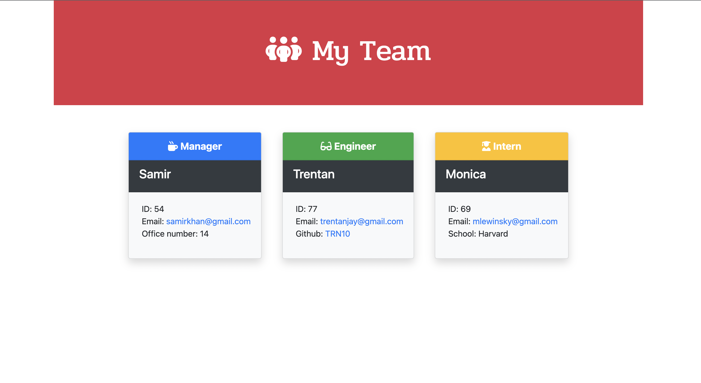

# team-profile-generator
## Coding Bootcamp week 10 challenge

This is a command line application which generates an HTML file called 'my team' which displays the members of a team based on the information provided by the user. The application is initialised by typing 'node index.js' in the terminal command line. The user is then presented with a series of inquirer prompts asking the name and details of the team manager followed by options to add engineer/s and intern/s. After entering the details of the team members and selecting 'finish building team' an index.html file with the team's details is generated in the 'dist' folder within the application folder. This challenge builds on skills and knowledge used in the week 09 README generator challenge. This challenge also introduces the use of class constructors to build the various types of employee objects and additionally uses Jest to create test.js files for each of the class constructors. I was able to reference the code from the week 09 README generator challenge as a starting point for this challenge. The number of different types of files and the folder structure introduced a new level of complexity for me. The biggest challenge for me this week was creating the test.js files and ensuring that all the tests passed successfully.

### Installation

The user is required to type 'npm install' in the command line to install requried node modules. The application is then initialised in the terminal by the command 'node index.js'.

### Usage

This application uses a series of inquirer prompts in the command line to build an HTML file which displays the details of the user's team. The HTML file is generated in the 'dist' folder located within the 'team-profile-generator' folder.

##### The repository for this application can be found at: 
https://github.com/TRN10/team-profile-generator

##### A screen recording displaying the functionality of the application can be found at:
https://drive.google.com/file/d/1pU-LtA1MdLzlZ8-4_txJHkUJglxDPk7O/view

##### Below is screenshot showing an example of the generated HTML file:

